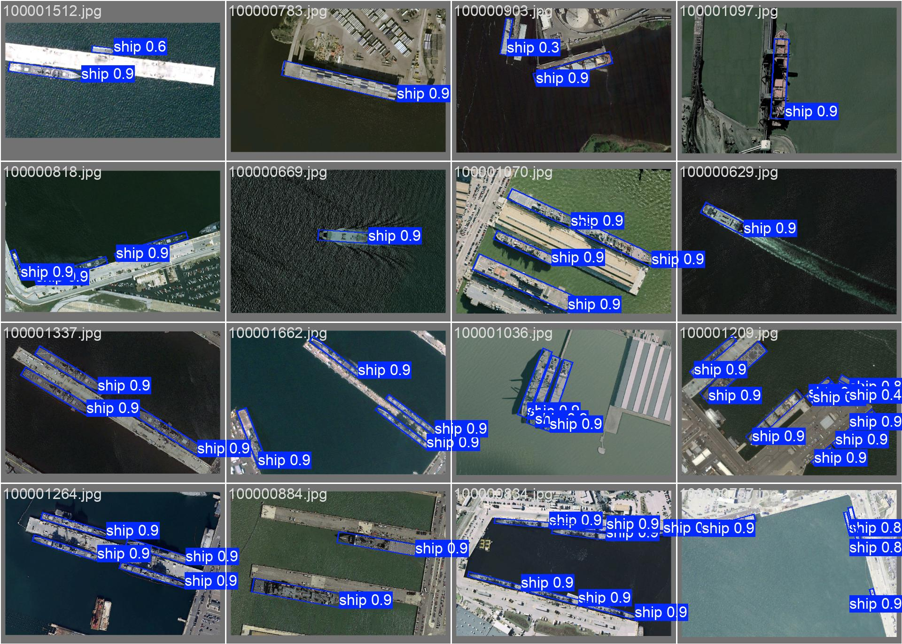
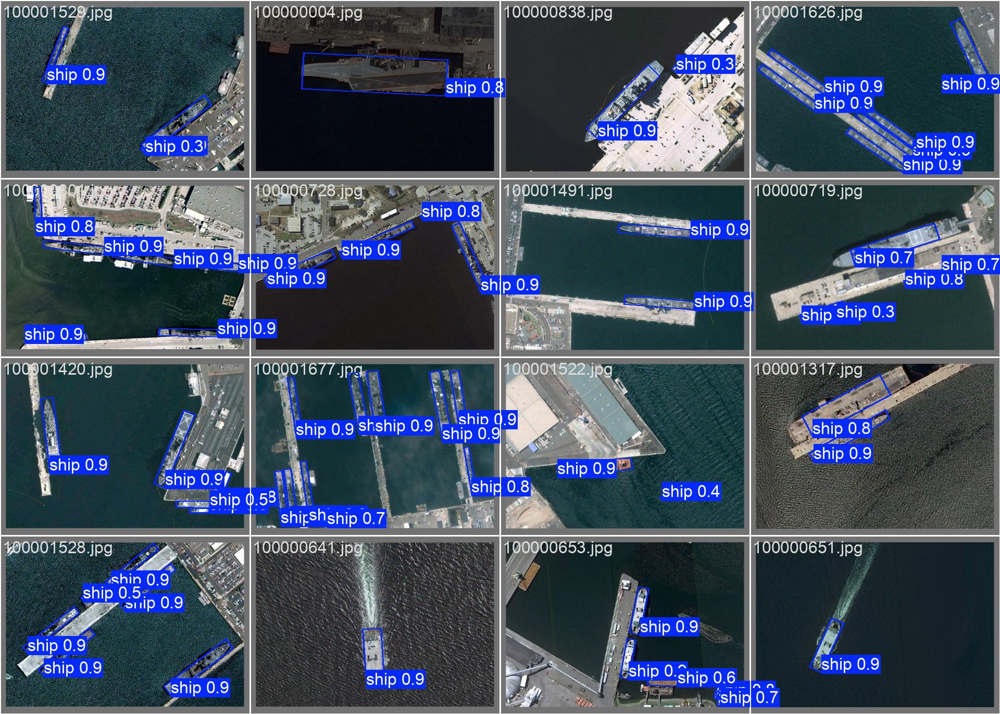
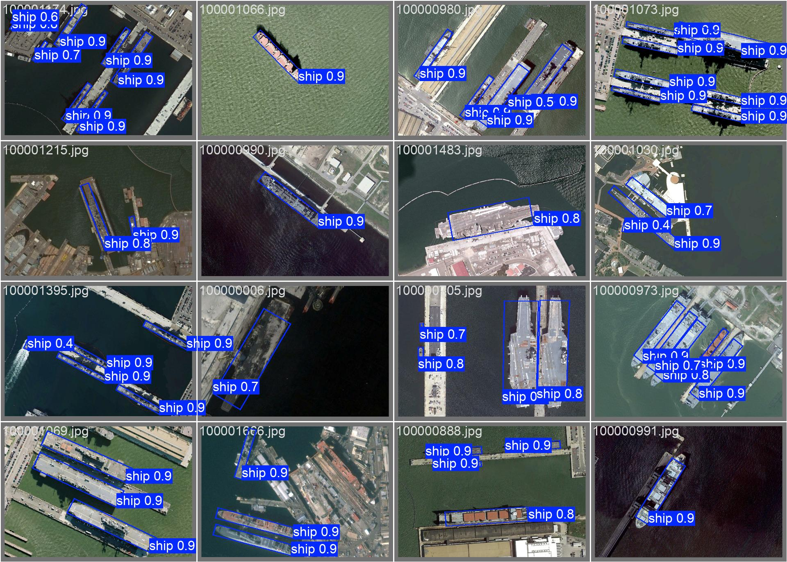

# satellite-photo_ship_obb_detection
- A repository for publishing the code of competitions I participated in.
- Competition details
  - [Competition](https://aifactory.space/task/4232/overview#-%EB%AC%B8%EC%A0%9C-%EA%B0%9C%EC%9A%94-%EC%98%88%EC%8B%9C) to develop an AI model to detect ships in satellite imagery.
  - Competition key points
    -  No separate training data is provided
    -  A competition where participants build a model to detect ships from a dataset of their choice, using sample data as a guide. 
    -  It is a competition where no test set is provided and you have to upload your inference code to see your score and improve the performance of your model.

## Usage Data
- [AIHub](https://www.aihub.or.kr/aihubdata/data/view.do?currMenu=&topMenu=&aihubDataSe=data&dataSetSn=73)
- [Kaggle Airbus Ship Detection Challenge](https://www.kaggle.com/competitions/airbus-ship-detection)
- [ShipRSImageNet](https://github.com/zzndream/ShipRSImageNet)
- [roboflow](https://universe.roboflow.com/marta-capito/airbus-ship-detection-5kzoi)
  
## utils
- ai_hub_yolo_convert.py : Code to convert AI HUB data to YOLO format
- ship_dataset_yolo_convert.py : Code to convert ShipRSImageNet data to yolo format
- airbus_ship_detection_yolo_convert.py : Code to convert the Kaggle Airbus ship detection challenge dataset to yolo format
- airbus_ship_yolo_convert.py : Code to convert data labeled with labelme to yolo format
- auto_labeling.py : Code to auto-label with a learned yolo model
- background_add.py : Code for adding background data when learning YOLO
- croping_image_save.py : Code for saving images after cropping
- label_filter.py : Code to filter out data without objects
- slide_window.py : Code to infer large resolution images with a sliding window approach
- zoom_out.py : Code to apply zoom out to training data only

## How to learn

Here's a structured description of your process:

1. **Data Preparation**:
   - Initially, you converted datasets (excluding Roboflow) into the YOLO format for model training.
   - After training, you used the trained model for auto-labeling on the Roboflow dataset.
   - Additionally, you labeled a dataset using Labelme, converted it into the YOLO format, and performed further model training.

2. **Zoom-out Augmentation**:
   - You applied zoom-out augmentation only to the training set. This was necessary because, during testing, objects were too small due to cropping. 
   - The zoom-out process was performed with a scale value of 0.3 to allow for multi-scale training.

3. **Inference**:
   - To handle high-resolution images (10980 x 10980), you employed a sliding window approach during inference. This method allows the model to process large images by dividing them into smaller overlapping segments.

This process helped address the issue of small objects and improved detection performance on the target dataset.

## Main Library Installation
- pytorch uses version 2.4.1
```
pip install -r requirements.txt
```


## model train
```
./train.sh
```

## model eval
```
./eval.sh
```
test dataset eval results
- The reported performance is based on a custom split of the data (train/valid/test) rather than the competition-provided test set. The model's performance in the competition was poor due to the inability to find a suitable dataset for predicting the test set and frequent misclassification of clouds as ships. Due to time constraints and the inability to invest more time in the competition, the code will be made public midway through the event. The dataset used for training consisted of 47,835 samples in the training set, 9,269 samples in the validation set, and 846 samples in the test set.

| dataset | mAP50-95 | mAP50 | map75 | R | P | model link |
| --- | --- | --- | --- | --- | --- | --- |
| test dataset | 0.7652 | 0.9047 | 0.8487 | 0.788 | 0.909 | [link](https://drive.google.com/file/d/1BcggyQ6ZkQ7FfZNJDb29_VibWQIqQTBg/view?usp=sharing) |

## Learning outcome image



